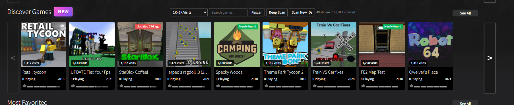
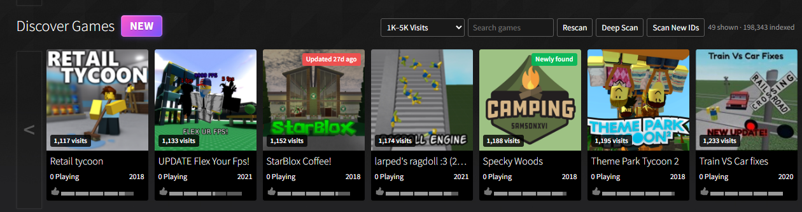

# Korone Discovery+

Korone Discovery+ is an unofficial userscript that expands the game-discovery tools available on the Korone games page. It replaces the normal **Classics** row with a searchable **Discover Games** section backed by a locally stored index of public games.

The addon is intended to make smaller, recently updated, and otherwise difficult-to-find games easier to discover without changing the underlying Korone website or game pages.



## What the addon does

Korone Discovery+ adds the following features to the games page:

- An **Every Game** view for browsing indexed public games
- A searchable local game index
- A **Recently Updated** view
- A daily **Game of the Day** card with a live player count
- Alerts when newer Place IDs may be available to scan
- A resumable full Place ID scanner
- A lighter **Rescan** for refreshing current game data
- A **Deep Scan** for checking additional game lists and search terms
- Saved scan progress
- Lazy-loaded thumbnails
- Progressive index loading to reduce page lag
- Local caching of game metadata and player counts



## How it works

Korone Discovery+ runs only on the Korone home and games pages listed in the userscript metadata.

The addon uses Korone same-origin game endpoints to:

- Read the available game sorts
- Read game lists
- Request details for batches of Place IDs
- Request game thumbnails
- Refresh player counts and update timestamps

The full scanner checks numeric Place IDs in small, delayed batches. Public root games are stored in the browser's `IndexedDB` database. Lightweight settings, scan progress, alerts, and cached list data are stored in `localStorage`.

The addon loads only part of the full index into memory at a time. More indexed games are loaded progressively as needed so the page is less likely to freeze.

The Game of the Day is selected once per local calendar day from eligible indexed games. Before a game is featured, the addon checks that it currently has at least one player. The selected game is stored locally for that day.

## Installation

1. Install a userscript manager such as Tampermonkey or Violentmonkey.
2. Open `KoroneDiscovery+.user.js`.
3. Choose the userscript manager's install option.
4. Visit the Korone games page.
5. Allow browser notifications when prompted if new-game alerts are desired.

Only one copy of Korone Discovery+ should be enabled at a time.

## Usage

Open the games page and find the **Discover Games** row.

### Views

- **Every Game** — shows games from the indexed catalog.
- **Recently Updated** — shows games with a recent update timestamp.
- **1K–5K Visits** — focuses on smaller games with between 1,000 and 5,000 visits.

### Controls

- **Search games** — searches game names, creators, descriptions, and genres.
- **Rescan** — refreshes the normal game lists and visible live data.
- **Deep Scan** — searches additional sorts, genres, and keywords.
- **Full Scan / Resume Full Scan / Scan New Games** — builds or continues the public Place ID index.
- **Alerts: On/Off** — controls browser notifications for newly detected IDs.
- **See All / Load More** — progressively renders more matching games.

The full scan may be paused and resumed. Closing the page does not erase saved scan progress.

## Userscript permissions

The userscript metadata uses:

```text
@grant none
```

No privileged userscript-manager APIs are requested.

The addon uses standard browser features available to page scripts:

- `fetch`
- `localStorage`
- `IndexedDB`
- `Notification`
- `MutationObserver`
- `requestAnimationFrame`

Browser notification permission is optional. The main discovery features work without it.

## External APIs and third-party services

Korone Discovery+ does **not** use external analytics, advertising APIs, OpenRouter, or other third-party data services.

It only sends requests to same-origin Korone endpoints, including game-list, game-details, and thumbnail endpoints hosted by the site itself.

No API keys are included in the addon.

## Privacy

The addon does not intentionally collect or transmit personal information.

Game index data, settings, cached results, and scan progress are stored locally in the current browser profile. Clearing site data or userscript storage may remove that information.

## Warnings and disclaimers

- This is an unofficial community addon and is not developed or supported by the Korone team.
- Do not request support for this addon in general Korone support channels. Use the addon's dedicated forum post.
- A full Place ID scan can take a long time because requests are deliberately delayed.
- Running the full scanner in several tabs at once may create unnecessary requests and may trigger rate limits.
- The scanner should not be modified to remove delays or aggressively request the site.
- Browser notifications only work after the user grants permission.
- The addon changes the appearance and contents of the Classics row but does not alter game files or the Korone client.

## Known limitations and compatibility

- The addon depends on the current Korone page structure and API responses. Major site changes may require an update.
- It is designed for modern Chromium- and Firefox-based browsers with `IndexedDB`, `fetch`, and userscript support.
- The full index is specific to the browser profile where it was created.
- Newly created games are not guaranteed to appear until a scan reaches their Place IDs.
- Player counts are refreshed in controlled batches and may not update instantly.
- The Game of the Day changes when the addon initializes on a new local date. A tab left open across midnight may need a refresh, revisit, or rescan before the featured game changes.
- Private, moderated, inaccessible, or non-root subplaces may not be included.
- Large indexes use browser storage and may consume a noticeable amount of disk space.

## Updating the addon

Install the newer `.user.js` file over the existing userscript. The addon attempts to preserve its local index and scan progress between compatible updates.

## Support

Questions, bug reports, and support requests must be posted in the addon's dedicated forum post in accordance with the Korone Unofficial Addons repository support policy.

When reporting a bug, include:

- Browser name and version
- Userscript manager and version
- Addon version
- The page where the issue occurred
- A screenshot
- Any relevant browser-console errors

## License

This submission is provided under the license and contribution requirements of the Korone Unofficial Addons repository.
